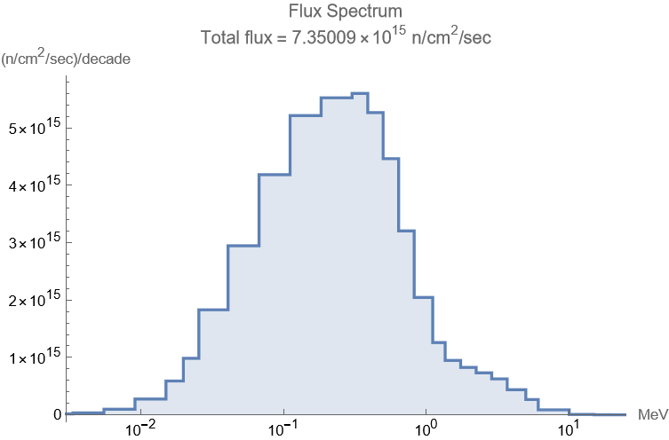

# datashare
This repo contains the data necessary to reproduce the CRAM calculations for the Whitmer and Zimmerman
article "Computing the Time-Averaged Nuclide Inventory Using the Chebyshev Rational Approximation Method".
Typically the construction of a transmutation matrix M will be complex and require many assumptions. 
By providing the exact matrices used, we can avoid ambiguity.

## The list of nuclides
There are 3793 nuclides in our 'decay chain' (regardless of whether they appear in the problem in a non-zero amount), and they are listed in
the file `nuclidelist`, which begins with:
```
#   1:   10010  H   1
#   2:   20010  H   2
#   3:   30010  H   3
#   4:   30020  He  3
#   5:   40020  He  4
#   6:   50020  He  5
#   7:   50030  Li  5
#   8:   60020  He  6
#   9:   60030  Li  6
#  10:   60040  Be  6
[...]
```

A 4-digit id number is provided in text columns 2 through 5. There follows an `AZS` identifier, 
which provides 3 digits of the mass number A followed by 3 digits for the atomic number Z. 
A last digit S indicates any metastate level. 
Three more fields help with human interpretation of the nuclide.

These two entries show familiar nuclide examples:
```
#3418: 2350920  U 235
#3419: 2350921  U 235*
```
The rows of each matrix correspond in order to the production of the listed nuclides. Thus the first row of the 
matrix details H1 production, etc.

## The decay matrix for section V.A. - _The Decay of Fission Products with mass Number 78_
There is no neutron flux in this problem, so we have a pure decay matrix, given as `decaymatrix.mtx`.
The matrix is in a MatrixMarket format; for details see: [http://math.nist.gov/MatrixMarket/formats.html#MMformat]

The matrix file begins:
```
%%MatrixMarket matrix coordinate real general
 3793  3793 134933
    1    7  2.25876488597760e+21
    1   10  2.79872884969594e+20
    1   20  8.21371482728727e+17
    1   21  3.37532540098756e+00
    1   37  8.07863846806463e+01
    1   49  6.08397419959576e+19
    1   54  6.34750165347935e+00
    1   65  1.73286795139986e+07
[...]
    3    3 -1.78283181295801e-09
```
The matrix is sparse, and so only the row, column, and value of each non-zero entry is listed. All entries are in units of 1/sec. 

The first entry is row 1, column 7, which from the nuclidelist we recognize as protons (H1) produced from the decay of nuclide #7, Li5.
From the ENDF/B-VII.1 decay files we know the half-life of Li5 is 3.0687E-22 sec, so we expect a decay rate of ln(2)/3.0687E-22, which 
matches the entry here.

Likewise, nuclide #3 is tritium, with a half-life of 3.8879E+08 sec, so we expect the entry at 3,3 to be its decay constant of -ln(2)/3.8879E+08.

## The burn matrix for section V.B. - _Fresh Fuel Burn vs 1000 Time Steps_
For this problem there is a fast neutron flux, illustrated below, so there will be transmutations and fissions, making a more complicated matrix.

The matrix is derived from ENDF/B-VII.1 decay and fission files, as well as TENDL-2015 neutron production cross section files.

The provided file `burnmatrix.mtx` begins:
```
%%MatrixMarket matrix coordinate real general
 3793  3793 563859
    1    1 -6.81092728849532e-13
    1    2  4.35647610785570e-12
    1    4  1.21349941705521e-08
    1    7  2.25876488597760e+21
    1    9  4.14393593788978e-12
    1   10  2.79872884969594e+20
    1   12  1.19807400442473e-16
    1   13  5.18010808140429e-08
[...]
```
The second line of the file shows there will be 563,859 entries. This is many more than the decay matrix has, but is still sparse.
	
	
